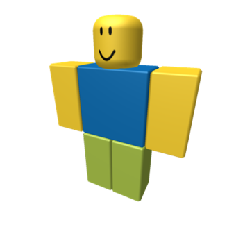

# SLC Shadertoy Noob notebook

I'am working hard to make this page something more serious and usefull, something you can rely on.

For the moment please excuse me because it's a total mess.

* TOC
{:toc}

## Notes month per month
### Notes of March 2021

| Shader | Comments | Preview |
| -------- | -------- | -------- |
| [pjkarlik - Gyroid Jungle Thing](https://www.shadertoy.com/view/WlsBR8) | I love the texture applied. |  |
| [LukeRissacher - Museum of random planets](https://www.shadertoy.com/view/XttGzj) | Interested by the colors, noise function and the terrain having terraces. |  |
| [patu - Wreck Scanners ](https://www.shadertoy.com/view/4tfyzf) | Interest by the artistic work and the DOF effect. Nice to see the Gamma correction effect. |  |
| [TekF - Realistic Flag](https://www.shadertoy.com/view/3tcfDf)   | May be very usefull to adapt with a different pattern ! |  |
| [munrocket - Fast glow with iteration count](https://www.shadertoy.com/view/3dcXWX)   | I searched a lot time how to make a glow effect. Finally get one from Shaw, this one may help also. |  |
| [Friol - The dream of a red paper plane ](https://www.shadertoy.com/view/wsBBDV) | Poetic and generative music. Under rated shader ! |  |
| [Shane - Hexagonal Maze Flow ](https://www.shadertoy.com/view/llSyDh) | Many details, many advice, like the "Very basic hatch line effect." |  |
|[Shane - Cellular Blocks ](https://www.shadertoy.com/view/ltySRt)|Just Awsome||
|[stb splitting things](https://www.shadertoy.com/view/XdKSWW) | Illusion of living things ! Only an illusion because in reallity just a reaction diffusion simulation formula. ||
| [Kali - Circuits](https://www.shadertoy.com/view/XlX3Rj) | Impressive 2D Fractal |  |

### Notes of February 2021

I want probably make another shader related more to geomery than modelling, especially methods for having more domain repetition methods. There is many topics possibles. Like this [Fibonacci mapping](https://dokumen.tips/reader/f/spherical-fibonacci-mapping-fibonacci-mapping-benjamin-keinert-1matthias-innmann)

| Shader | Comments | Preview |
| -------- | -------- | -------- |
| [Quick Lighting Tech](https://www.shadertoy.com/view/ttGfz1) | Blackle : A gold mine of tricks for a fast ligthing, the [Youtube Video](https://youtu.be/FilPE91ACOA) is great. Discovered his [page](https://suricrasia.online/demoscene/functions/) about live coding GLSL functions. |  |
| [Coaster Jungle ](https://www.shadertoy.com/view/tl3fRS) | Good use of domain repetition. |  |
| [High-Collar Cubes](https://www.shadertoy.com/view/WldBRH)  | I like the patterns on these cubes, the rendering to good also. |  |
| [Perfect Pistons Example](https://www.shadertoy.com/view/Wl3fD2) | Blackle Tricks How to make domain repetition without artifacts. Many ideas in the discussion. |  |
| [Alchemical symbols](https://www.shadertoy.com/view/3scyWN) | I like this way to display symbols using SDF |  |
| [Xyptonjtroz](https://www.shadertoy.com/view/4ts3z2) | Many nice effects from nimitz, noise and dust storm. |  |
|[Dry ice 2](https://www.shadertoy.com/view/WlVyRV)|Nice fog simulation||
| [Metallic Tubeworms](https://www.shadertoy.com/view/3ltfzM) | DR2 made it before I do ! |  |
| [4D Wild Kifs](https://www.shadertoy.com/view/wttBzM)  | Iapafoto Awsome again |  |
| [Metaballs: Let's get together](https://www.shadertoy.com/view/4lKXzd) | A lot of tricks on golfing shared in the comments of this simple shader. |  |
| [Paint streams](https://www.shadertoy.com/view/WtfyDj) | Shader of the week, awsome fluid simulation.||

### Notes of January 2021

* I may have the idea to create a [syringe](http://t1.gstatic.com/images?q=tbn:ANd9GcQdQBMzk80Wb1Ez37QRUeum5zDsP5JB7YIglZhZnFKrLw5-9Z8zBTHxLtga53eDfrMcGF2YoFmrBYB1_ekUs0c) with 2021 on it instead of the graduation marks.
* I wanted to create an **aminated character**, but the hair modeling is tricky. I leart about Beriez curves, there is an analytical distance fonction for quadratic because they are planar (3 control points), not for cubic (4 control points, the most communly used). I found another approach using arc of circles in [this](https://www.ryanjuckett.com/biarc-interpolation/) paper with C++ code and [this](https://arxiv.org/pdf/1711.00935.pdf) PDF using Mathlab. There about approximating [Spirals](https://www.rug.nl/research/portal/files/14477957/05c5.pdf).
* There is a lot of ideas in [this shader](https://www.shadertoy.com/view/wlj3zV) in the comments about creating "splines" using arc of cirles. The try I'am currently doing with 3 joints main interest many guys, but I have to make it clean. The idea is to provide a length for the total of the join and have 3 numbers to set the proportions of the 3 segments.

| Shader   | Comments | Preview  |
| -------- | -------- | -------- |
|[Simple Bend](https://www.shadertoy.com/view/Wlt3DM)|IQ shows a way to bend the space, I also had a deep look at "Joint 3d" of iapafoto.||

| Shader   | Comments | Preview  |
| -------- | -------- | -------- |
|[Octopi](https://www.shadertoy.com/view/3tycDW) | A rope function based on spline interpolation that may be very usefull for animation ! ||
| [Drippy Room](https://www.shadertoy.com/view/MstGWX) | Water effect to study ||
| [Raymarch template GGX](https://www.shadertoy.com/view/3tyyWm) | A proposal for a template thanks to darkeclipz ||
| [Specular highlight models ](https://www.shadertoy.com/view/WtycWW) |At least I will understand how to get a specular ligthing. ||
|[Marble Marcher: SE](https://www.shadertoy.com/view/3lKyDR) | Playable game ! A big piece of work. ||
| [Electric Flower (Music)](https://www.shadertoy.com/view/3lVyD1)|Nice effect for the music. Using buffer feedback effect seems simple. |  |
| [Warping - procedural 2](https://www.shadertoy.com/view/lsl3RH)|IQ teaching Deformation of procedural textures as far I understand, to be studied. |  |
|[Procedural walk animation](https://www.shadertoy.com/view/WlsSWS)| Procedural animation, very difficult exercice. ||
|[SH18 Woman](https://www.shadertoy.com/view/4tdcWS)|Photographic look||
|[Head](https://www.shadertoy.com/view/wlf3WX)|How to model an human head using SDF. ||
|[Meditation for dummies](https://www.shadertoy.com/view/Md3GR4)|Head by Iapafoto||
|[Sparks from fire](https://www.shadertoy.com/view/wl2Gzc)| Good fire particle effect ||
| [lots o' particles](https://www.shadertoy.com/view/wl2Gzc) | Making particles in a shader is not simple, this is a try to use multipass but the move of the particles is very limited. |  |
| [Buckyball Fracture](https://www.shadertoy.com/view/WlKyzW) | Many be usefull when trying some **explosion effects** |  |
| [Ray marching practice 5](https://shadertoy.com/view/4sKBW3) | The **flower** shape seems to me very good, it's not easy to get a petal. |  |
| [Danger Noodle ](https://www.shadertoy.com/view/wlVSDK)  | Perfect modelling, the skin and the eyes are incredible, BigWings masterpiece. |  |
|[Mandelcloud explorer](https://www.shadertoy.com/view/wttyDX) | I like the fuzzy rendering. And the code seems accessible to me. |  |
| [Euclidean Honeycombs](https://www.shadertoy.com/view/WsfcRn) | How to tile the 3D space. | |
|[Two Tweets](https://www.shadertoy.com/view/MsfGzM)|Found this shader in the IQ playlist, very short like a Tweet,  my understanding is that this is a minimal ray marching algorithm. Try `return length(fract(p)-.5)-0.2; ` to get spheres ||
|[Joe Gardner (Soul Pixar)](https://www.shadertoy.com/view/3ltyRB)| This shader show a neat and nice looking approach to compute transparent objects. **usefull to me** ||
|[TIE Fighters](https://www.shadertoy.com/view/WlcyD7)|dean_the_coder is not stopping to publish very elaborated SDF modelling, keeping the code short and clear. Many comments too about optimization. Impressive ! ||
|[hexastairs: ladder like + doors](https://www.shadertoy.com/view/wsyBDm)|Fabrice gives a neat example of how to make false 3D using hexagons tiles. Inspiring ! One can imagine to make a animated character here. ||
|[Marching Die](https://www.shadertoy.com/view/3sVBDd)|Shane publishing a new shader is always an event, like when you just received your favorite magazine.||
|[Planetary gears golfed ( 439 ch)](https://www.shadertoy.com/view/ttdyRs)|Nice logo creation, golfed by Fabrice||
|[Caves - WebGLSamples ](https://www.shadertoy.com/view/wsyBWc)|Interactive creation on holes in a terrain||

### Notes of December 2020

Studied the shape of the Helix

I had the idea to study the shape of the Helix, there is many examples of it on Shadertoy.
I have an idea seems fun to make a scytale ! https://en.wikipedia.org/wiki/Scytale
These can be found [searching using the helix keyword](https://www.shadertoy.com/results?query=helix&sort=popular&from=24&num=12)

| Shader   | Comments | Preview  |
| -------- | -------- | -------- |
| [Springs of Arbitrary Profile](https://www.shadertoy.com/view/ttB3DV) | **usefull to me** |  |
| [DNA helix](https://www.shadertoy.com/view/lt33RB) | shader with a lot of usefull functions **usefull to me** |  |
| [Infinite stair](https://www.shadertoy.com/view/tdlfWX) | One of Fabrice's many pulishing **inspiring to me** |  |

### Other shaders and acticles that interested me in December

| Shader   | Comments | Preview  |
| -------- | -------- | -------- |
| [OKLab color space](https://www.shadertoy.com/view/WtccD7)     | **RGB** is not the perfect tool to pick a color based on human perception, **HSV** is widely used instead, and this **OKLab** encoding even seems a better approach for some good reasons. **usefull for me**     |      |
| [Day at the lake](https://www.shadertoy.com/view/wl3czN) | Cloud, water, terrain, **still magical for me**. |  |
|[Polyhedron again](https://www.shadertoy.com/view/XlX3zB)|Polyhedrons good reference by **knighty**||
| [Wythoff construction](https://www.shadertoy.com/view/ldXczX) | Contruction of polyhedrons based on reflextions, perfect to be used in a shader. It's based on repeated reflexions regarding 3 plans, not really easy to me to visualize the construction. The numbers refers to the fractions of angles on the triangular tiles and the pipe sign the position of the point to use as vertex to the polyhedra. **interested** |      |
| [AURORA landscape](https://www.shadertoy.com/view/ttScDc) | **still magical for me** |  |
| [opensimplex noise](https://www.shadertoy.com/view/tttyRH) | Even if seems there is many other noise functions possible and found on Shadertoy, this one is a "well known" and popular one, there is a **Coding Train** youtube video about it. **usefull to me** |  |
| [metaball shader](https://shadertoy.com/view/4sXXWM) | colorfull, don't know how it works yet. **still magical** | Preview not available ?   |
| [Clickable Starfield](https://www.shadertoy.com/view/XlcSDr) | I had noticed this Incredible work of iapafoto |  |
| [Clickable Starfield](https://www.shadertoy.com/view/ttGyDW) | Reworked by Ollj |  |
| [Shaw - WASP Coils](https://www.shadertoy.com/view/WdjSDw) | Here I found at least a clear way of how to make an easy **glow effect** : Shaw and helix **usefull to me** |  |
| [Satisfaction Machine](https://www.shadertoy.com/view/tdGfDy) | Great idea, Helix **usefull to me** |  |
| [Modeling of the bridge, and boat](https://www.shadertoy.com/view/Xd3fWr) | fast and accurate using spheres and cylinder intersect |  |
| [Flame shader](https://www.shadertoy.com/view/WsccDH) | fast and nice. Theory behind to read also. IQ liked it, it should be good. |  | 
| [Snow is falling](https://www.shadertoy.com/view/4lfcz4) | Snow falling from tholzer good effect |  |
| [Miracle Snowflakes](https://www.shadertoy.com/view/Xsd3zf) | There is a music sound shader in this one. |  |
|[Sphere and Cable](https://www.shadertoy.com/view/wlKXWc) | A ball in a torus made of cables, well animated and rendered. Notable equation for cables reaction. Fabrice made a golfed version of it. |  |
|[Christmas 2016 orbs](https://www.shadertoy.com/view/ltcSzs) | Many light sources, interested me |  |
|[Rosace 3d](https://www.shadertoy.com/view/ldcSzB)| Oh nooo ! Fabrice short rosace with textures. Seems a variant of the twister trick. ||
|[Polar Grid Motion](https://www.shadertoy.com/view/XtcfRH) | Shane again ! ||
| [Magic Particles Multi-Pass](https://www.shadertoy.com/view/ld3GWS) | How to add magic sparks ||
| [Magic Sparks](https://www.shadertoy.com/view/Xs33R2) | Nice ||
| [GPU Bossa (sound)](https://www.shadertoy.com/view/tdyfRy) | Very relaxing sound  |  |
| [The Shining](https://www.shadertoy.com/view/3stBDf) | It is nice to see short AND readable programs, very usefull style, but too bloody for me ! The preview is black. |  |

### Notes of November 2020

| Shader   | Comments | Preview  |
| -------- | -------- | -------- |
|[Several types of stella](https://www.shadertoy.com/view/WsyfWh)|To be studied ||

| Shader   | Comments | Preview  |
| -------- | -------- | -------- |
|[TRuck Driving](https://www.shadertoy.com/view/wsGBDh)|Very fun ! ||
|[(not) moving circle illusion](https://www.shadertoy.com/view/tdyfRR)|Fun illusion !||
|[Fabrice's utilities](https://www.shadertoy.com/view/llySRh)|||
|[Joint 3D from iapafoto](https://www.shadertoy.com/view/tdyBDh)|very usefull for modelling. I wonder if there is a problem with the sign function that becomes zero and causes some artifacts at some instants (difficult to capture). ||
|[impulse_glass](https://www.shadertoy.com/view/lttBzN)|Refractions||
|[Whack-A-Mole Pistons](https://www.shadertoy.com/view/WtXcWB)| I copied the Mettalic effect. [Video explanation from Blackle]( https://www.twitch.tv/videos/590616102) and [fake ibl tdhooper](https://www.shadertoy.com/view/tlscDB) ||
|[Arrows](https://www.shadertoy.com/view/MlGSRR)|Re usable patterns||
|[Interactive fluid with caustics](https://www.shadertoy.com/view/ttdXRf)|[Fluid simulation](http://developer.download.nvidia.com/GTC/SIGGRAPH_Asia_2011/PDF/WaterSim_Chentanez.pdf) Seems the height **fluid** simulation of my nephew Cyrille||
|[Spiral patterns](https://www.shadertoy.com/view/4ljBWd)|I copied this one to do my Helix shader procedural texture.||
|[Golfed](https://www.shadertoy.com/view/MtjfDG)|Golfed version.||
|[Human Meat Grinder ](https://www.shadertoy.com/view/Ws3Bzf)|This shader uses a dedicated shade function , good idea to keep|| 
|[Selfie girl](https://www.shadertoy.com/view/WsSBzh)|IQ published Hoody (renamed Selfie girl) and it's just mind blowing. There is a youtube video about how it's modelled and enlightened ! ||

I wanted to do a domain repetition using a **spiral**, also wanted to make a distance "for comments" shader. This led to my Christmas shader.
[Spiral equations](http://benice-equation.blogspot.com/search/label/Spiral)
I saw 3 types of spirals
* Log spirals as used by IQ to create a snail.
* Archimedian spirals that I used because there is a constant spacing between spires.
* Double center spirals that are just built on arc of circles. 

| Shader   | Comments | Preview  |
| -------- | -------- | -------- |
| [a Cube in a spiral](https://www.shadertoy.com/view/wdGfzD) |||
| [Spiral with N branches](https://www.shadertoy.com/view/4ldyWN) |||
| [Fabrice helix here](https://www.shadertoy.com/view/lsdfD8) |||
| [This spiral with UV is used](https://www.shadertoy.com/view/Mdd3R7) |||
| [Nyarchimedes Spiral ](https://www.shadertoy.com/view/lsS3WV) |**usefull to me** to create my Christmas shader. ||
| [wet ink britney](https://www.shadertoy.com/view/4l33zN) |Again UV on an archimedian spiral||
| [Fabrice Short spiral](https://www.shadertoy.com/view/wls3W4) |||
| Nice https://www.shadertoy.com/view/4tdczl |||
| [Logpolar domain repetition]( https://www.shadertoy.com/view/wdsSWs) |||
| Very cool particle system with rendering [Folosh Demosplash 2020](https://www.shadertoy.com/view/wstBzf)|||
|https://www.shadertoy.com/view/Xtlyzl| Seems there is a challenge to make very short shaders using the apollonian 3D fractal, this is totally crazy ||
|[Fast edge detection](https://www.shadertoy.com/view/4s2XRd)|is very nice for cartoon like shading.||
|I love also [Jungle Gym](https://www.shadertoy.com/view/tsjfRw) cartoon like shading. |||
|This one https://www.shadertoy.com/view/WsyfzR is using the webcam to onboad us in the flying saucer, and there is a very nice glow effect to rip. This is using a closeness out variable in the ray marching procedure.|||
|https://www.shadertoy.com/view/Xtl3zf |I have to learn about texutes that is a full domain of knowledge and may start by this one from IQ about to create non repetitive textures||
|https://www.shadertoy.com/view/llySRh |I never really understood how to make a good use of the font texture, but this shader from Fabrice may help || 
|https://www.shadertoy.com/view/Wd3BWj |Usage of the font texture||
|https://www.shadertoy.com/view/XsjBWW |the is also this great one short||
|https://www.shadertoy.com/view/lt2SDc |A large number of metaballs to simulate cell division ||
|https://www.shadertoy.com/view/Ws3fR7|A simple effect Ocean effect||
|https://www.shadertoy.com/view/ts3fDs|A very short Twister shader||
|[3D Cellular Tiling](https://www.shadertoy.com/view/ld3Szs)| Shane is source of inspiration and astonishment, I should go to have a deep look at it.||
|https://www.shadertoy.com/view/lsfcRB |Noticed nice Torus based shaders of balkhan Kaiman, this one has a blackbody color function||
|[Snaliens](https://www.shadertoy.com/view/tlV3zy) |This very nice shader of the day is simple but colorfull and using simple 2d primitives with blending. Note for myself : I have to be cute to be liked, because I'am not technically impressive !||
|[over the moon](https://www.shadertoy.com/view/4s33zf)|There is also the Bigwings tutorials [other the moon](https://www.youtube.com/watch?v=LLZPnh_LK8c) about blending and 2d effects.||
|[Torus Pipes](https://shadertoy.com/view/wlj3zV)|by iq. shows how to make a jonction of capped torus to make a long pipe. Here there is 32 capped torus, this is impacting the frame rate. I see now obvious way to improve by boxing, the calculations are already quite cheap. Will not be fluid on mobile, but good on PC.||
|[Dancing Tentacle](https://shadertoy.com/view/XldSDn)|by mplanck. A very fun tentacle with Inverse Kinematic||
|https://www.shadertoy.com/view/XtSyzh|Cubic truchet is very nice and there is a lot of examples in Shadertoy, even a good explanation here. This shader uses also the keyboard with memory of key pressed ! Usefull. ||
|https://www.shadertoy.com/view/4lfcRl|One among many Shane examples, **greatly commented with lot of tricks !** I like the little Windows blinking.||
|https://www.shadertoy.com/view/MtSyRz|This one managed to implement a flow in the truchet 3d pattern||

Fabrice's explanation of keyboard input and other features [here](https://shadertoyunofficial.wordpress.com/2016/07/20/special-shadertoy-features/)

care should be done about textures borders and Mip Mapping. 
Seems this need to be managed to avoid artifacts.
Don't know for the moment how to do it.

### Notes of October 2020

| Shader   | Comments | Preview  |
| -------- | -------- | -------- |
|[Fab31 #inktober2020 "crawl" ](https://www.shadertoy.com/view/3d3fRr)|During Inktober, Fabrice made a crawling worm.||
|https://shadertoy.com/view/WldGWM|this may be a good exercice to make it with joins as described by IQ here||
|https://www.shadertoy.com/view/3tKGDW |What is missing is the function to get the position matrix for the next segment of the joint. This in done in 3D by PixelPhil in a function named joint3DMatrix||
|https://www.shadertoy.com/view/3ld3DM|this in not in the IQ example for joints, Would probably have to make it from my own.||
|https://www.shadertoy.com/view/XtSczy|There is also inverse kinematik approach like in||
|https://shadertoy.com/view/XldSDn|very nice||
|https://www.shadertoy.com/view/Xtf3Rj|This one ||

## My creations

### My published shaders

I don't publish all my creations and experiments, I only set a shader public when I think it's presentable and can be inspiring, I think this is what everyone is doing, this avoids to have too much public shaders to browse on Shadertoy. 

In general, I also try to gives instructions to have different fun results by a simple modification of a line of code. **This is a toy** ! 

Many times, friends ask me **how many time** it took to me to make these shaders.
I can tell between 10 to 20 hours of cumulated work in general to get a presentable result for the community and publish it. 
First have the idea and want to share it, work on the message associated to your creation, and good animation, limited artifacts, colors etc. 
As IQ repeat in these videos, **you just need to fix ugly things**, and this needs a lot of time for a newbie, but it's realy pleasant. And the more you learn, the more you are able to see ugly things to fix.

By inverse order of creation time.

| Shader | Comments | Preview |
| -------- | -------- | -------- |
| [Bee Waggle Dance](https://www.shadertoy.com/view/ssX3W2) | I started by trying to replicate the map of my dinner room that has some bee pattern on it, and this ended with this. |  |
| [Egg Hunt](https://www.shadertoy.com/view/ttyfDV) | Very quickly done with the new template of BigWings plus domain repetition and fun result ! I think the humain brain is wired to catch Eggs. |  |
| [Heart Ribbon](https://www.shadertoy.com/view/wtdBzl) | The Helicoid shape is far more complicated than I expected, obviously because with the difference of the Archimedian spiral, it's a 3D space figure. |  |
| [Waiting for two injections](https://www.shadertoy.com/view/3tGcDR) | On this one I played with the 3D fonts and the transparent effect. There is also a more serious message, of hope for 2021. But I'am not here to propagate any political message. |  |
|[Happy New Year using a Scytale !](https://www.shadertoy.com/view/3tdczX)| My creation after searching for HELIX functions. |  |
|[Decorated Christmas Spiral](https://www.shadertoy.com/view/3dVfDc)| After searching for archimedian spiral functions. Fun to see that many comments were about the twisted cylinders wrapped around the spiral, much simplier to get. |  |
|[Kawaii Looper Caterpillar](https://www.shadertoy.com/view/WdcfDs)| After studying IQ's joint functions based on a set of capped torus, and BigWings 2D shaders technics (smiley face youtube tutorials). I had fun testing the results of diffrents procedural patterns from Shane, I spent also many time to work on the amination. ** * ||
|[Rocket planet](https://www.shadertoy.com/view/wdVyDR) | After searching for some polyhedron functions in order to compute only 1 rocket. ||
|[Walking donuts](https://www.shadertoy.com/view/tscfzs)  | After working on polar repetition. **tuto**||
|[Roundabout symetry](https://www.shadertoy.com/view/ts3yzB)  |**tuto** polar repetition, I think this transformation is missing the the IQ page about distance functions. But this is mentioned in one of his video tutorial. ||
|[Rocket Toy](https://www.shadertoy.com/view/3dSBRG)|***Was very happy with this one***. I modelled the rocket for the first time with IQ's SDFs, without even understanding how the ligthing is working. Added a BigWings tutorial starfield background. Tried also a glow effect. Newbies can dare all. ||
|[SDF for Moss's Egg - for comment](https://www.shadertoy.com/view/wsBBR3) |I'am so proud, this stupid function of mine (total newbie) is mentioned on the IQ page about 2D distance functions (of course, optimized by IQ) ! This pushed me to study more distance functions, on spirals, helix ... ||

